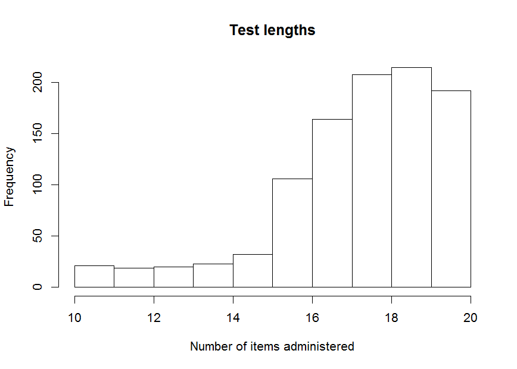
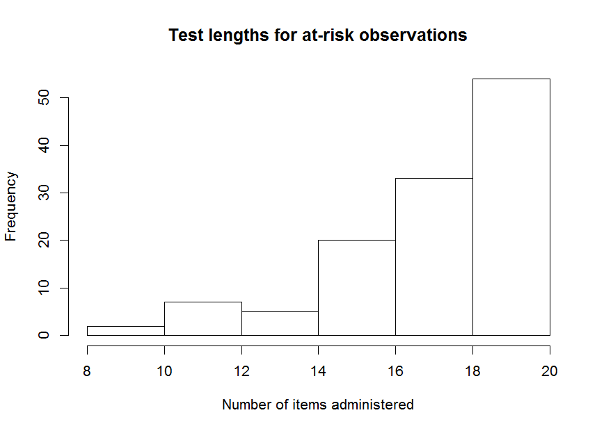
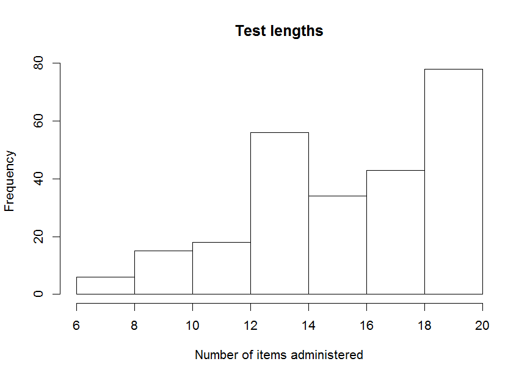

curtail: an R package for test curtailment
==========================================

A curtailed test is a variable-length test, which allows for early stopping of item administration when further items are unlikely or unable to change the final (classification) decision. Package curtail allows for creating and assessing deterministically and stochastically (based on empirical proportions) curtailed tests.

Example
-------

To get a first impression of how curtail works, we take a dataset of item scores on a 20-item test:

``` r
library(curtail)
head(itemscores)
```

First, we will apply deterministic curtailment on a subset of 500 observations, using a cut-off value of 17:

``` r
tmp1 <- Curtail(itemscores[501:1000, ], Xstar = 17)
#>              full length
#> curtailed     at risk not at risk
#>   at risk         125           0
#>   not at risk       0         375
```



We can also obtain some desciptive statistics about the number of items administered and proportion of observations for which the testing was ceased before the full-length test was administered:

``` r
tmp1$curtailed.test.length.distribution
#> $mean
#> [1] 18.196
#> 
#> $standard.deviation
#> [1] 1.618277
#> 
#> $median
#> [1] 18
#> 
#> $proportion.curtailed
#> [1] 1
```

The results show the number of observations flagged as 'at risk' or 'not at risk', according to the curtailed and full-length test administration. Also, the number of items administrered is depicted in a histogram. As is always the case with detereministic curtailment, no classification errors with respect to the full-length test decsion are made. We did however manage to obtain a substantial reduction in test length.

Perhaps we can further reduce test length through stochastic curtailment. We use the first 500 observations for training and the next 500 observations for testing:

``` r
tmp2 <- stochCurtail(itemscores[1:500,], dataset.test = itemscores[501:1000,], 
                     Xstar = 17)
#>              full length
#> curtailed     at risk not at risk
#>   at risk         121           0
#>   not at risk       4         375
```



``` r
tmp2$curtailed.test.length.distribution
#> $mean
#> [1] 17.37
#> 
#> $standard.deviation
#> [1] 2.435768
#> 
#> $median
#> [1] 18
#> 
#> $proportion.curtailed
#> [1] 1
```

We were able to reduce the number of items administered somewhat, at the cost of four incorrect decisions (out of 500).

Perhaps we want to inspect test length distributions for at-risk observations separately:

``` r
hist(tmp2$test.results$current.item[tmp2$test.results$curtailed.decision == "at risk"], 
     xlab = "Number of items administered", 
     main = "Test lengths for at-risk observations")
```



If we want to obtain tables with item-specific cutoff values, we can use the Table (for deterministic curtailment) function:

``` r
Table(itemscores, Xstar = 17)
#>         item1 item2 item3 item4 item5 item6 item7 item8 item9 item10
#> no.risk    NA    NA    NA    NA    NA    NA    NA    NA    NA     NA
#> risk       NA    NA    NA    NA    NA    17    17    17    17     17
#>         item11 item12 item13 item14 item15 item16 item17 item18 item19
#> no.risk     NA     NA     NA     NA      1      4      7     10     13
#> risk        17     17     17     17     17     17     17     17     17
#>         item20
#> no.risk     16
#> risk        17
```

Values NA indicate that curtailment is not yet possible for that item and decision. For stochastic curtailment, we can employ the stochTable function:

``` r
stochTable(itemscores, Xstar = 17)
#>         item1 item2 item3 item4 item5 item6 item7 item8 item9 item10
#> no.risk    NA    NA    NA    NA    NA    NA    NA    NA    NA      0
#> risk       NA    NA    NA    NA    14    14    14    15    15     15
#>         item11 item12 item13 item14 item15 item16 item17 item18 item19
#> no.risk      1      2      3      5      6      8      9     10     13
#> risk        16     16     16     17     17     17     17     17     17
#>         item20
#> no.risk     16
#> risk        17
```

Here we see that stochastic curtailment allows for earlier stopping of item administration than deterministic curtailment.

Perhaps we want to assess the accuracy of decisions based on stochastic curtailment using leave-one-out cross validation. This can be done using the stochCurtailXval function. As this is computationally intensive, in this example we only apply the function to the first 100 observations, but normally we should apply this function to the whole dataset:

``` r
stochCurtailXval(itemscores[1:100,], Xstar = 17)
```


    #>              full length
    #> curtailed     at risk not at risk
    #>   at risk          11           0
    #>   not at risk       2          87
