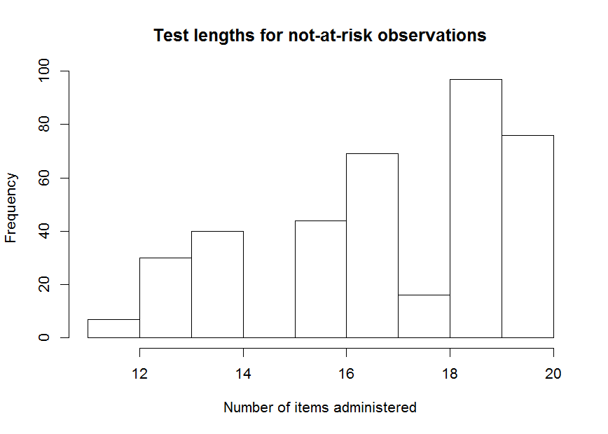

curtail: an R package for test curtailment
==========================================

A curtailed test is a variable-length test, which allows for early stopping of item administration when further items are unlikely or unable to change the final (classification) decision. Package curtail allows for creating and assessing deterministically and stochastically (based on empirical proportions) curtailed tests. The package allows for test curtailment through the creation of look-up tables, providing item-specific cut-off values for early stopping of item administration. In addition, the package allows for assessing efficiency (number of items administered to arrive at a final decision) and accuracy (concordance between the final decision based on curtailed and full-length test).

Example
-------

To get a first impression of how curtail works, we take a dataset of item scores on a 20-item test:

``` r
library(curtail)
head(itemscores)
```

First, we apply deterministic curtailment on all observations, using a cut-off value of 17:

``` r
tmp <- Curtail(itemscores, Xstar = 17)
#> $risk
#>                          full length: 'at risk'
#> curtailed: flagged 'risk' FALSE TRUE
#>                     FALSE   702    0
#>                     TRUE      0  298
#> 
#> $no.risk
#>                             full length: 'not at risk'
#> curtailed: flagged 'no risk' FALSE TRUE
#>                        FALSE     0  702
#>                        TRUE    298    0
```


``` r
summary(tmp$current.item)
#>    Min. 1st Qu.  Median    Mean 3rd Qu.    Max. 
#>   10.00   17.00   18.00   17.67   19.00   20.00
```

The results show the number of observations flagged as 'at risk' or 'not at risk', according to the curtailed and full-length test administration. Also, the number of items administrered is depicted in a histogram. As is always the case with detereministic curtailment, no classification errors with respect to the full-length test decsion are made. However, we did manage to obtain a substantial reduction in test length.

Perhaps we can further reduce test length through stochastic curtailment. We use the first 500 observations for training and the next 500 observations for testing:

``` r
tmp <- stochCurtail(itemscores[1:500,], dataset.test = itemscores[501:1000,], 
                    Xstar = 17)
#> $risk
#>                          full length: 'at risk'
#> curtailed: flagged 'risk' FALSE TRUE
#>                     FALSE   375    4
#>                     TRUE      0  121
#> 
#> $no.risk
#>                             full length: 'not at risk'
#> curtailed: flagged 'no risk' FALSE TRUE
#>                        FALSE   121    0
#>                        TRUE      4  375
```


``` r
summary(tmp$current.item)
#>    Min. 1st Qu.  Median    Mean 3rd Qu.    Max. 
#>    8.00   16.00   18.00   17.37   19.00   20.00
```

We were able to reduce the number of items administered only slightly, at the cost of four incorrect decisions.

Perhaps we want to inspect test length distributions for at-risk or not-at-risk observations only:

``` r
hist(tmp$current.item[tmp$SCrisk], xlab = "Number of items administered", 
     main = "Test lengths for at-risk observations")
```


``` r
hist(tmp$current.item[tmp$SCnorisk], xlab = "Number of items administered", 
     main = "Test lengths for not-at-risk observations")
```



If we want to obtain tables with the item-specific cutoff values, we can use the Table and stochTable functions:

``` r
Table(itemscores, Xstar = 17)
#>         item1 item2 item3 item4 item5 item6 item7 item8 item9 item10
#> no.risk    NA    NA    NA    NA    NA    NA    NA    NA    NA     NA
#> risk       NA    NA    NA    NA    NA    17    17    17    17     17
#>         item11 item12 item13 item14 item15 item16 item17 item18 item19
#> no.risk     NA     NA     NA     NA      1      4      7     10     13
#> risk        17     17     17     17     17     17     17     17     17
#>         item20
#> no.risk     16
#> risk        17
stochTable(itemscores, Xstar = 17)
#>         item1 item2 item3 item4 item5 item6 item7 item8 item9 item10
#> no.risk    NA    NA    NA    NA    NA    NA    NA    NA    NA      0
#> risk       NA    NA    NA    NA    14    14    14    15    15     15
#>         item11 item12 item13 item14 item15 item16 item17 item18 item19
#> no.risk      1      2      3      5      6      8      9     10     13
#> risk        16     16     16     17     17     17     17     17     17
#>         item20
#> no.risk     16
#> risk        17
```

Perhaps we also want to assess the accuracy of decisions based on stochastic curtailment, using leave-on-out cross validation. This can be done using the stochCurtailXval function. As this is computationally intensive, in this example we only apply the function to the first 250 observations:

``` r
stochCurtailXval(itemscores[1:250,], Xstar = 17)
```


    #>                          full length: 'at risk'
    #> curtailed: flagged 'risk' FALSE TRUE
    #>                     FALSE   145    0
    #>                     TRUE      0  105
    #>                             full length: 'no risk'
    #> curtailed: flagged 'no risk' FALSE TRUE
    #>                        FALSE   105    0
    #>                        TRUE      0  145
